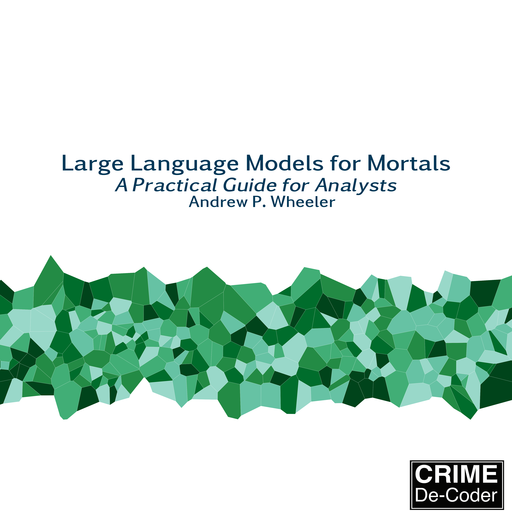

# Large Language Models for Mortals: A Practical Guide for Analysts with Python

These are additional materials for my book, *Large Language Models for Mortals: A Practical Guide for Analysts with Python*. ISBN 979-8-9903770-7-3 (ebook), ISBN 979-8-9903770-6-6 (paperback). Available to purchase in [epub](https://crimede-coder.com/cdcstore/product/large-language-models-for-mortals-a-practical-guide-for-analysts-with-python/) or [paperback version](https://crimede-coder.com/cdcstore/product/large-language-models-for-mortals/) from the Crime De-Coder store.



Any feedback on the book, feel free to leave here on Github, or [message me directly](https://crimede-coder.com/contact).

Andy Wheeler
[Crime De-Coder LLC](https://crimede-coder.com/)


## Description

Large language models for mortals is a practical introduction to using foundation model APIs with python. Major components include the basics of understanding how to call and the response objects for OpenAI, Anthropic, Google, and AWS Bedrock models. It also discusses specific components of API libraries, like structured outputs, batch processing, embeddings and RAG systems, tool calling, agents, and model-context-protocol servers. It also has a chapter illustrating different coding LLM tools (GitHub Copilot, Claude Code, and Google's Antigravity).

The intended audience are traditional data scientists looking for practical examples of using foundation model APIs, scientists looking to use these tools for their own research, or analysts looking to use the tools to help automate analyses of large sets of textual data.

## Table of Contents 

```
Large Language Models for Mortals: A Practical Guide for Analysts with Python
by Andrew Wheeler

TABLE OF CONTENTS

Preface
    Are LLMs worth all the hype?
    Is this book more AI Slop?
    Who this book is for
    Why write this book?
    What this book covers
    What this book is not
    My background
    Materials for the book
    Feedback on the book
    Thank you
1 Basics of Large Language Models
    1.1 What is a language model?
    1.2 A simple language model in PyTorch
    1.3 Defining the neural network
    1.4 Training the model
    1.5 Testing the model
    1.6 Recapping what we just built
2 Running Local Models from Hugging Face
    2.1 Installing required libraries
    2.2 Downloading and using Hugging Face models
    2.3 Generating embeddings with sentence transformers
    2.4 Named entity recognition with GLiNER
    2.5 Text Generation
    2.6 Practical limitations of local models
3 Calling External APIs
    3.1 GUI applications vs API access
    3.2 Major API providers
    3.3 Calling the OpenAI API
    3.4 Controlling the Output via Temperature
    3.5 Reasoning
    3.6 Multi-turn conversations
    3.7 Understanding the internals of responses
    3.8 Embeddings
    3.9 Inputting different file types
    3.10 Different providers, same API
    3.11 Calling the Anthropic API
    3.12 Using extended thinking with Claude
    3.13 Inputting Documents and Citations
    3.14 Calling the Google Gemini API
    3.15 Long Context with Gemini
    3.16 Grounding in Google Maps
    3.17 Audio Diarization
    3.18 Video Understanding
    3.19 Calling the AWS Bedrock API
    3.20 Calculating costs
4 Structured Output Generation
    4.1 Prompt Engineering
    4.2 OpenAI with JSON parsing
    4.3 Assistant Messages and Stop Sequences
    4.4 Ensuring Schema Matching Using Pydantic
    4.5 Batch Processing For Structured Data Extraction using OpenAI
    4.6 Anthropic Batch API
    4.7 Google Gemini Batch
    4.8 AWS Bedrock Batch Inference
    4.9 Testing
    4.10 Confidence in Classification using LogProbs
    4.11 Alternative inputs and outputs using XML and YAML
    4.12 Structured Workflows with Structured Outputs
5 Retrieval-Augmented Generation (RAG)
    5.1 Understanding embeddings
    5.2 Generating Embeddings using OpenAI
    5.3 Example Calculating Cosine similarity and L2 distance
    5.4 Building a simple RAG system
    5.5 Re-ranking for improved results
    5.6 Semantic vs Keyword Search
    5.7 In-memory vector stores
    5.8 Persistent vector databases
    5.9 Chunking text from PDFs
    5.10 Semantic Chunking
    5.11 OpenAI Vector Store
    5.12 AWS S3 Vectors
    5.13 Gemini and BigQuery SQL with Vectors
    5.14 Evaluating retrieval quality
    5.15 Do you need RAG at all?
6 Tool Calling, Model Context Protocol (MCP), and Agents
    6.1 Understanding tool calling
    6.2 Tool calling with OpenAI
    6.3 Multiple tools and complex workflows
    6.4 Tool calling with Gemini
    6.5 Returning images from tools
    6.6 Using the Google Maps tool
    6.7 Tool calling with Anthropic
    6.8 Error handling and model retry
    6.9 Tool Calling with AWS Bedrock
    6.10 Introduction to Model Context Protocol (MCP)
    6.11 Connecting Claude Desktop to MCP servers
    6.12 Examples of Using the Crime Analysis Server in Claude Desktop
    6.13 What are Agents anyway?
    6.14 Using Multiple Tools with the OpenAI Agents SDK
    6.15 Composing and Sequencing Agents with the Google Agents SDK
    6.16 MCP and file searching using the Claude Agents SDK
    6.17 LLM as a Judge
7 Coding Tools and AI-Assisted Development
    7.1 Keeping it real with vibe coding
    7.2 VS Code and GitHub Install
    7.3 GitHub Copilot
    7.4 Claude Code Setup
    7.5 Configuring API access
    7.6 Using Claude Code to Edit Files
    7.7 Project context with CLAUDE.md
    7.8 Using an MCP Server
    7.9 Custom Commands and Skills
    7.10 Session Management
    7.11 Hooks for Testing
    7.12 Claude Headless Mode
    7.13 Google Antigravity
    7.14 Best practices for AI-assisted coding
8 Where to next?
    8.1 Staying current
    8.2 What to learn next?
    8.3 Forecasting the near future of foundation models
    8.4 Final thoughts
```

## Preview

See the pdf file `llms_mortals_preview.pdf` for a preview of the first 60+ pages in the book.

## Environment

I used conda to create the python environment to compile the book. To create the environment to compile the book, it is something like this:

    conda create --name llm_book -c conda-forge python=3.12 gliner sentence-transformers jupyter jupyter-cache anthropic openai boto3 pypdf tiktoken google-genai cohere chromadb docling faiss pypdfium2 llama-index matplotlib mcp pydantic-ai pydantic-graph duckdb google-adk claude-agent-sdk

Now, this is over the top. If you just want to run the openai examples, you would just install the openai libraries. (No need for pytorch, anthropic, google, etc.) The book is compiled via Quarto/Jupyter as well, so that is just for the book contents (not necessary for the actual examples).

You can see the libraries I am using via the `requirements_freeze.txt`, which was generated via `pip list --format freeze`.

The book itself has instructions for setting up unique environments (for MCP I use `uv` and not `conda` for example, but for Antigravity agents I show how to make a shell script to use conda). Understanding environments is important for the coding agents, so just copying my requirements is probably not helpful.

## Additional Book Materials

You can see the introduction plus the first three chapters here. Some of the code examples in the chapters require additional materials to run. I have placed them here in this repository.

### Chapter 3

These are examples I used as inputs to OpenAI, Google, and Anthropic to show how you can pass in files to interpret.

 - Raleigh search and seizures document, saved as `RaleighSearchSeizure.pdf`, downloaded from <https://public.powerdms.com/RPD1/tree/documents/866204> on 12/5/2025
 - Monthly robberies in Chicago chart, `MonthlyRobberiesChicago.png`, see my crimepy python library for how this was generated, <https://github.com/apwheele/crimepy/blob/main/notebooks/TimeSeriesCharts.ipynb>
 - Audio file, `WebMapAudio11sec.mp3`, first 11 seconds from this Youtube video I made, <https://www.youtube.com/watch?v=mBm6sTR08BI&t=35s>, on describing the cartographic decisions I made around an interactive hotspot map.
 - Audio file, `TrimmedPodcast.mp3`, audio of 95 seconds to 130 seconds from my LEAP podcast with Jason Elder, <https://www.leapodcasts.com/e/atwje-dr-andrew-wheeler-crime-de-coder/>
 - Stata Base Reference Manual (V19), limited to the first 1000 pages, downloaded from <https://www.stata.com/manuals/r.pdf> on 12/13/2025
 - The MP4 video file, `DurhamHotspotClipped.mp4`, is seconds 4:00 to 4:30 of this Youtube video <https://www.youtube.com/watch?v=mBm6sTR08BI> describing a slippy map of Durham hotspots of crime I created


### Chapter 4

I made a test set of cases to show evaluating structured outputs in the `crime_test_data.csv` file. This is entirely made up data.

### Chapter 5

These are examples I used in Chapter 5, RAG. Documents downloaded on 12/7/2025.

 - Raleigh policy documents, via <https://public.powerdms.com/RPD1/tree>
   - 865833.pdf, Use of Force and Weapons
   - 866145.pdf, Interacting with Vulnerable Populations
   - 866181.pdf, Response to Trespassing Complaints
   - 866217.pdf, Taxis and Towing
   - 2208425.pdf, Unmannded Aerial System (UAS) Operations

For the scanned document, I printing out Interacting with Vulnerable Populations (866145.pdf), and then scanned it back in to demonstrate OCR'ing the document.

I also use the Stata reference documentation (see url in Chapter 3), split out with the Table of Contents and the actual document.

### Chapter 6

I use example data from Dallas. You can see the script to download this data from the Dallas open data site at <https://github.com/apwheele/apwheele/blob/main/dallas_data.py>. This data was downloaded in a github action on 12/26/2025 (last date of data on 12/24/2025).

I then used the `prep_dallas_crime.py` script to slightly modify that file (to include column categories instead of the numeric labels, and strip out some data).

The file `crime_mcp.py` is the mcp server script I used in the book with the Claude Desktop tool. You can see my conversation at <https://claude.ai/share/6c14cb84-cdbe-475e-91cd-acf4240f3a60> (unfortunately that does not show the artifacts).

### Chapter 7

The MCP server is a custom one I wrote (with the help of Claude Code) using the [gemimg python library](https://github.com/minimaxir/gemimg), which is a wrapper for Google Gemini image generation models.

`Fig3_KDE_Surveys.png` is from a journal article of mine, [*Mapping Attitudes Towards the Police at Micro Places* (Wheeler et al., 2020)](https://link.springer.com/article/10.1007/s10940-019-09435-8). It is an (anonymized) kernel density map of surveys at different locations.

The sub folder `incident_app` is a Flask app I had Google Antigravity create as an example in the chapter.

This folder also contains `Prompts.txt` with several examples of the longer prompts I wrote in the chapter.


